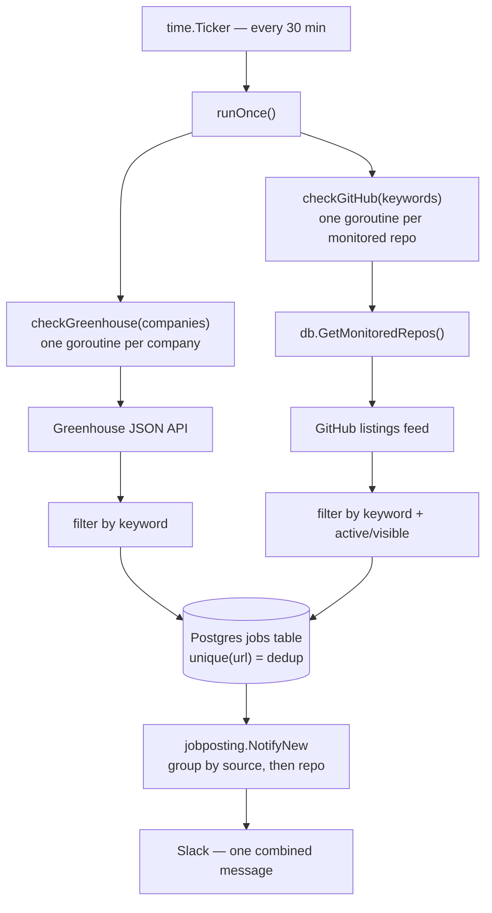
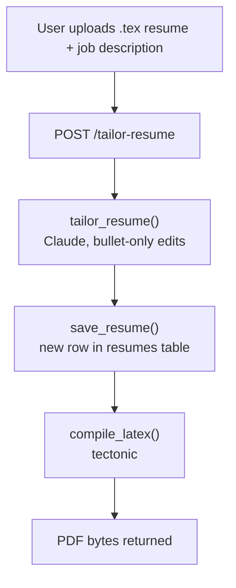
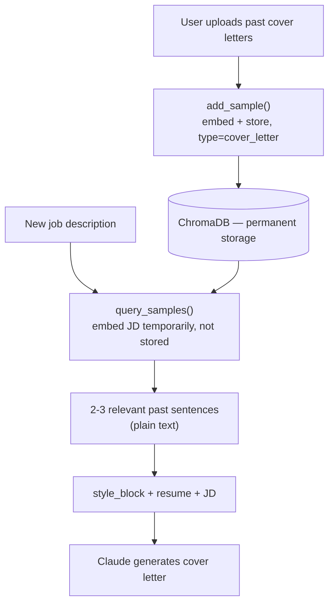

# Architecture

Three flows built so far, each with a diagram + plain-language walkthrough. Status noted per flow — some pieces are code-complete but unverified pending Claude account credits.

---

## 1. Job monitoring (Go backend) — fully working

- Ticker fires every 30 minutes, also runs once immediately on startup.
- `checkGreenhouse` and `checkGitHub` run **at the same time** (goroutines), not one after another.
- GitHub's repo list comes from the `monitored_repos` table, not hardcoded — dynamic, addable later via the extension.
- Every fetched job gets keyword-filtered before it's even considered for saving.
- All jobs pass through Postgres's `unique(url)` constraint — that's the actual dedup boundary, not application code.
- Only genuinely **new** rows (not duplicates) make it into the final Slack message.
- One Slack message per check, grouped by source and repo — never one message per job.

---

## 2. LaTeX resume tailoring — code complete, Claude call pending credits

- User's raw `.tex` + a job description go in together.
- Claude edits **only the bullet-point wording** — structure, sections, and LaTeX commands are locked by the system prompt, never touched.
- Every tailored version is saved as a **new row**, never overwriting the base resume or a previous version — each is linked to the job it was made for.
- The edited `.tex` gets compiled to a real PDF via `tectonic` (no full TeX Live install needed).
- **Verified live:** the compile step (tectonic) and the DB save step both work end to end today. The Claude edit step itself is wired but can't be confirmed working until the Anthropic account has credits.

---

## 3. Cover letter generation with RAG — wired, Claude call pending credits

- Past writing samples are **embedded once and stored permanently** in ChromaDB, tagged `type: "cover_letter"` so retrieval never mixes them with resume bullets.
- A new job description is embedded too, but only **temporarily** — just to run one search, never saved.
- That search returns the 2-3 most relevant past sentences as plain text — semantic similarity, not keyword matching.
- Retrieved text gets folded into the Claude prompt as a `style_block`, ahead of the resume and job description.
- Style-matching is **optional by design** — if no samples exist yet, `query_samples` returns a clean empty list (confirmed live, no error), `style_block` stays empty, and Claude falls back to a solid, professional letter with no style-matching attempted.
- **Status:** fully wired end to end. The Claude call itself is unverified pending account credits, same as the other two Claude-calling flows.
